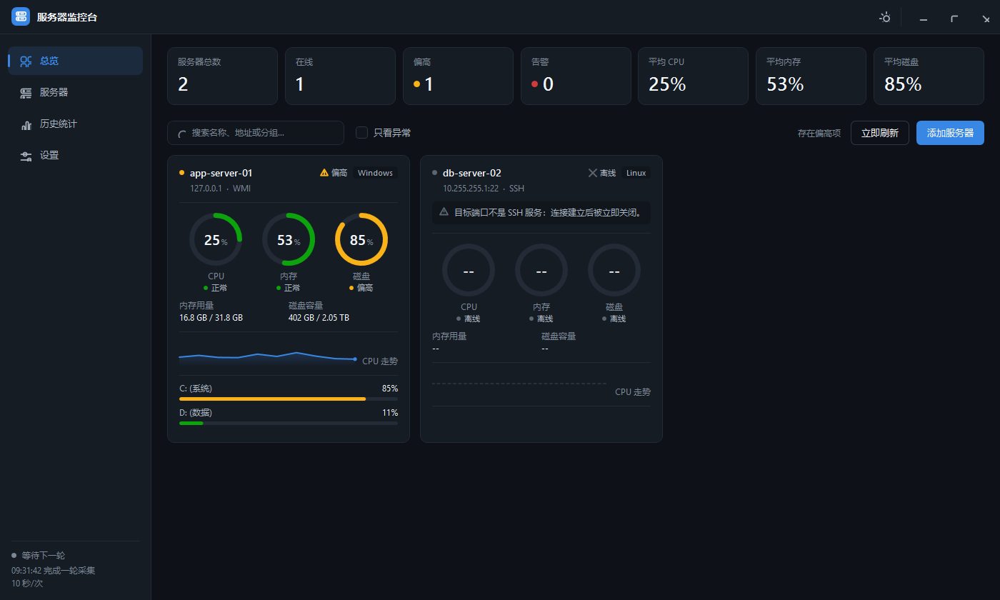
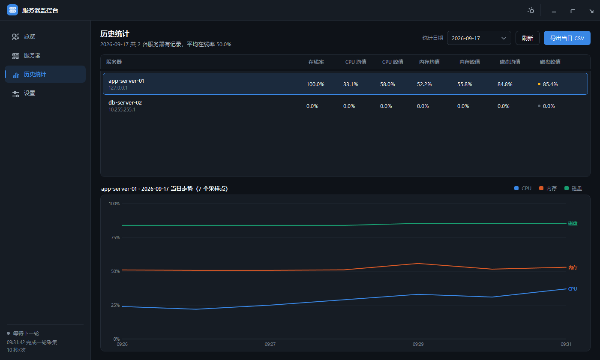

# 服务器监控台 · 使用手册

这份手册讲**怎么用**：从跑起来、接入第一台服务器，到日常盯盘和排障。

三份文档的分工：

| 文档 | 讲什么 |
|---|---|
| [README.md](../README.md) | 项目总览与技术设计（为什么这么写） |
| [tools/README.md](../tools/README.md) | 目标机接入的细节与排障 |
| **本手册** | 从头跑起来，以及日常怎么操作 |

---

## 一、跑起来

### 1. 构建

```cmd
build\build.cmd
```

产物在 `src\ServerMonitor\bin\Release\net45\ServerMonitor.exe`。

锁定 .NET Framework 4.5、**拷贝即用、零安装**——目标环境 Windows Server 2012 R2
自带 4.5.1，不需要装任何运行时。

### 2. 运行

双击 exe 即可。这是一个桌面程序，需要有人登录的会话，不是 Windows 服务。

### 3. 数据放在哪

默认在**程序旁边**的 `data\` 子目录；如果程序目录不可写（比如装在 `Program Files` 下），
会自动改用 `%LOCALAPPDATA%\ServerMonitor\`。

**实际用了哪个路径，启动日志里会打印**（「诊断日志」页第一行就是）。不用猜。

---

## 二、接入一台服务器

### 先按系统类型选路

| 目标机 | 走哪条路 |
|---|---|
| **Windows** | **SSH**（推荐）——跑 `tools\setup-ssh-target.cmd` |
| Linux | 手工建账号，确认 `sshd` 允许口令登录 |
| 监控程序自己跑在这台机器上 | 地址填 `127.0.0.1`，**用户名和口令都留空** |

> 「本机连接不能带凭据」是协议本身的限制（WMI 和 WinRM 都会直接报错），
> 不是程序的限制。程序在保存前就会提示这个组合连不上。

### Windows 目标机：跑脚本

1. 把**整个 `tools` 目录**拷到目标机。其中 `OpenSSH-Win64` 需要自行下载，
   下载地址见 [tools/README.md](../tools/README.md)（11MB 第三方二进制，没有随仓库分发）
2. 右键 `setup-ssh-target.cmd` →「以管理员身份运行」
3. 看到「配置完成」就好了

脚本会自动做四件事：

| 步骤 | 内容 |
|---|---|
| 1 | 创建采集账号 `monitor`，设置口令（运行时输入，直接回车则用默认值）、密码永不过期，加入 `Performance Monitor Users` |
| 2 | 把 `OpenSSH-Win64` 装到 `C:\Program Files\OpenSSH` 并注册服务 |
| 3 | 启动 `sshd`、设为自动启动、放行防火墙 TCP 22 |
| 4 | 自检：确认 22 端口在监听、账号在正确的组里 |

---

### 关于默认口令（重要）

脚本运行时会提示，**提示里直接写出默认口令是什么**，不用去翻脚本：

```
请输入账号 monitor 的口令（直接回车用默认口令 Srv@2026#Lan）: 
```

**直接回车**就采用脚本开头那行预设的值：

```cmd
set "DEFPASS=Srv@2026#Lan"
```

所以无人值守部署也不必改脚本——一路回车即可。想用自己的口令，在提示处手动输入就行。

配置完成后，脚本会把**这次实际生效的账号和口令回显在屏幕上**，照抄到监控端即可：

```
接下来在监控端：
  ...
  5. 用户名   ：monitor
  6. 口令     ：Srv@2026#Lan
  7. 点「测试连接」
```

> **本仓库是公开仓库，写死在这里的口令等同于对外公开。**
> 任何能看到这个仓库的人，都能用 `monitor` + 这个口令登录所有跑过脚本的机器。
> 所以：**正式环境务必改掉它。**

按场景挑改法：

| 想要的效果 | 怎么改 |
|---|---|
| 换一个自己的口令 | 运行时手动输入；或编辑脚本里的 `DEFPASS` 一行 |
| 每台机器用不同口令 | 把脚本复制多份，每份改一行 |
| 彻底禁掉默认值 | 把 `DEFPASS` 改成 `set "DEFPASS="`（清空）——此后必须手动输入，直接回车会报错退出 |

用到预设的那个默认口令时，脚本会在**开头的警告框**和**结尾的回显处**各提醒一次。

#### 口令要满足什么

Windows 的密码策略里有一条很容易踩：**口令不能包含用户名，或用户名中连续 3 位以上的片段**。

账号名是 `monitor`，所以下面这些都**会被直接拒绝**：

| 口令 | 为什么不行 |
|---|---|
| `Monitor@2026` | 含完整用户名 |
| `nominal123` | 含 `mon` |
| `torch#2026` | 含 `tor` |
| `editor@2026` | 含 `ito` |

另外还要满足复杂度要求（大写 / 小写 / 数字 / 符号**四选三**，长度下限看目标机设置，
默认 6 位）。脚本里预设的 `Srv@2026#Lan` 是满足的。

选口令时避开 `%`、`"`、`^` 这三个字符（CMD 解析问题）；`&`、`|`、`<`、`>` 在引号内是安全的。

#### 改脚本时注意编码

`setup-ssh-target.cmd` 是 **GBK（cp936）** 编码的，和 `cmd.exe` 的代码页一致。

**用编辑器改完请务必按「ANSI / GBK」保存，不要存成 UTF-8。**
UTF-8 的中文尾字节会撞上 `&`、`|` 这些 cmd 的元字符，注释行会被当成命令执行
（这是实测踩过的坑）。脚本开头特意加了 `chcp 936` 兜底。

如果目标机是英文版 Windows，中文可能显示成方块——那是缺中文字体，不影响功能。

---

### 监控端配置

回到监控程序，点「添加服务器」：

| 字段 | 填什么 |
|---|---|
| 名称 | 随便起，能认出来就行 |
| 地址 | 目标机的内网 IP |
| 系统类型 | **Windows** |
| 采集通道 | **SSH** |
| 端口 | `0`（用默认的 22） |
| 用户名 | `monitor`（配置完成时屏幕上回显的那个） |
| 口令 | 配置完成时屏幕上回显的那个 |

填完点「测试连接」。通了就保存。

---

## 三、界面导览

### 总览



- 顶部 7 项概览：总数、在线、偏高、告警、平均 CPU / 内存 / 磁盘
- 每台服务器一张卡片：三只环形仪表、状态文字标签、内存与容量明细、CPU 走势、磁盘列表
- 支持按名称 / 地址 / 分组搜索，以及「只看异常」过滤
- **在卡片上右键**可以编辑、测试连接、停用启用、删除

### 服务器管理

表格化列出全部服务器，含实时指标、更新时间和离线原因，可直接操作。
服务器多了之后，这页比总览页更适合逐台核对。

### 历史统计



这是「每天统计」的主要入口：

- 按日期查看每台服务器的**在线率、CPU 均值/峰值、内存均值/峰值、磁盘均值/峰值**
- 支持导出当日 CSV（带 BOM，Excel 打开中文不乱码）
- 下方走势图可切换服务器，鼠标悬停显示十字准线与数值

### 诊断日志

程序运行时的关键事件都会写进日志，出问题时这是第一手资料。
左侧「诊断日志」页可以实时查看、按级别筛选、导出成文件发给他人。

| 级别 | 记录内容 |
|---|---|
| `error` | 仅严重错误（程序自身缺陷、数据损坏） |
| `warn` | 错误 + 采集失败、认证失败等警告 |
| `info` | 再加上启动退出、服务器增删改等一般操作（**默认**） |
| `debug` | 再加上每台服务器的采集耗时与结果 |
| `trace` | 全部日志，含远程命令原文与原始输出 |

> 排查完记得调回 `info`。`trace` 会记录每条远程命令的原文和输出，日志涨得很快。

### 设置

刷新间隔、并发采集数、告警阈值、数据保留天数、日志级别、主题、数据目录，以及下方的推送配置。

---

## 四、告警推送

### 开启

设置页 → Webhook 一节：填地址、选渠道、打开开关。

- **只在异常时推送**：勾上之后，全部正常就不发，只在有服务器离线或超过阈值时推送
- 渠道选 **PushPlus** 时填 token，推送到微信；正文默认是模板拼的异常清单
- 渠道选 **通用 JSON** 时按结构化字段 POST，字段名是英文，方便对方的接口直接取用

正文里的异常清单只列有问题的机器 + 一行平均用量，完整明细走「历史统计」页。

### AI 摘要

勾上「用 AI 生成告警正文」，推送的正文就交给 AI 写成一段话，而不是模板拼的清单。

需要先在设置页配好 AI 接口（地址、模型、密钥）。密钥用 DPAPI 加密后落盘，不会明文存储。

> **两个要注意的地方：**
>
> 1. **数据出网。** 开启后会把**主机名、IP、系统类型和用量数据**发到你配置的那个接口地址。
>    如果这些信息不适合出内网，就不要开启，或者把接口地址换成自建的内网服务。
> 2. **会产生接口调用费用，而且慢。** 正文是模型现写的，一次调用通常要几秒，
>    按 token 计费。所以它适合放在告警推送里，不适合每次采集都调。

---

## 五、数据与备份

```
data\
├── servers.json                    服务器配置（口令是 DPAPI 密文）
├── settings.json                   全局设置
├── summary.json                    每日汇总（永久保留）
├── history\
│   └── 2026-09-17.json             当日原始采样，每分钟一条
└── logs\
    └── 2026-09-17.log
```

- **原始采样**：每分钟每台服务器一条，用于画全天走势；超过保留天数（默认 30 天）自动清理
- **每日汇总**：按「服务器 × 日期」记录均值与峰值，体积很小且**永久保留**——
  所以原始数据被清掉之后，长期统计也不会丢

### 备份

直接拷 `data\` 目录即可，没有数据库、没有外部依赖。

> **换机器或换 Windows 账户后，口令解不开。**
> 这是 DPAPI 的有意设计——配置文件被拷走也还原不出口令。
> 表现为服务器列表还在，但每台都报认证失败；重新填一次口令就好，历史数据不受影响。

---

## 六、常见问题

| 现象 | 原因 | 处理 |
|---|---|---|
| CPU 恒为 0，内存磁盘正常 | 账号不在 `Performance Monitor Users` 组 | 在目标机重跑一次配置脚本 |
| `认证失败` | 口令不对 | 重跑脚本重设口令，再回监控端改口令 |
| `连接超时` | 端口不通 | 确认 `sshd` 在跑、防火墙放行 TCP 22 |
| `'LC_ALL' 不是内部或外部命令` | 系统类型选成了 Linux | 编辑服务器 → 系统类型改成 **Windows** |
| 添加本机时提示不能填凭据 | WMI / WinRM 的协议限制 | 地址填 `127.0.0.1`，用户名和口令都留空 |
| 历史页某些日期是空的 | 那天的原始采样已被保留期清理 | 调大「数据保留天数」，或看 `summary.json` 里的长期汇总 |
| 换机器后全部认证失败 | DPAPI 密文解不开 | 重新填一遍口令 |
| 脚本中文显示成方块 | 目标机缺中文字体 | 不影响功能，可以不管 |

更多接入相关的问题见 [tools/README.md](../tools/README.md) 的「常见问题」一节。
